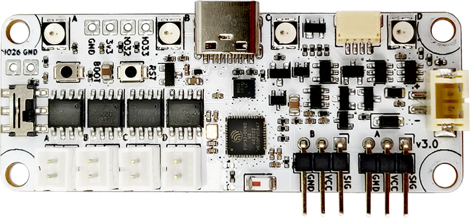
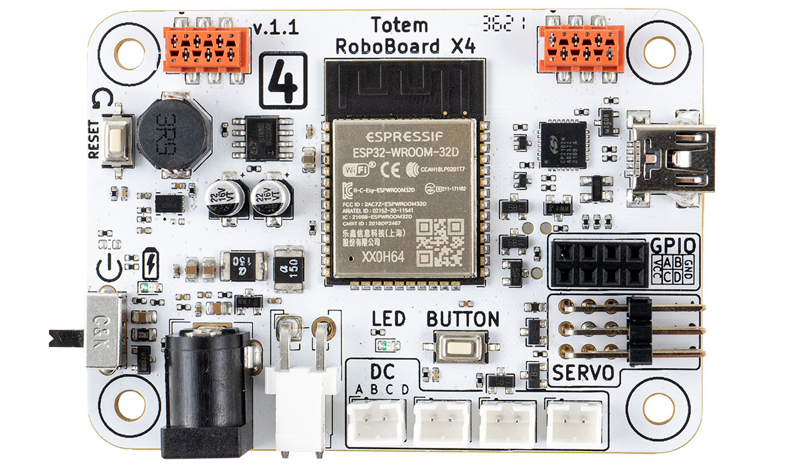
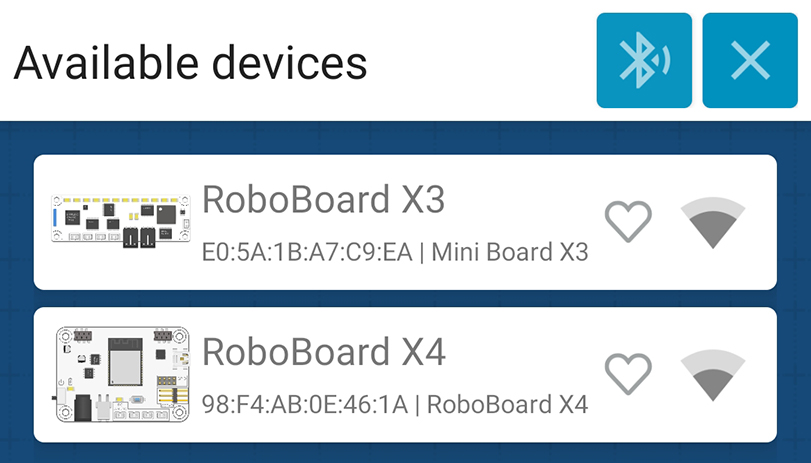
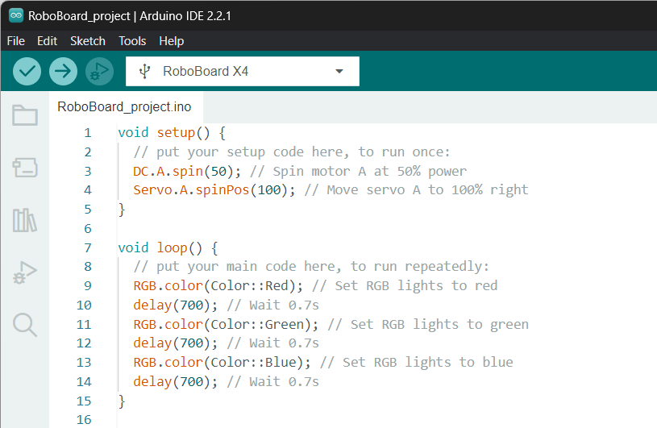
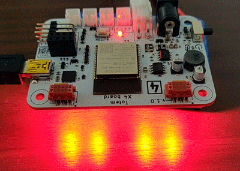

# RoboBoard

Totem RoboBoard is a family of ESP32 based Arduino development boards that combines most important robot building components (battery, motor drivers, wireless control) into single package. All complicated circuitry is embedded into board itself and controlled using extended Totem software package. This solution eases robot building with a few key advantages:

- Compact package.
- Extension ports and pins.
- Integrated battery charging.
- Built-in motor drivers, RGB, IMU sensor.
- ESP32 with Wi-Fi and Bluetooth connectivity.
- Arduino programming with extended [RoboBoard API](api/index.md).
- Remote control using [Totem App](#connect-with-smartphone).

| <center>RoboBoard X3</center> | <center>RoboBoard X4</center> |
| --- | --- |
| [](../roboboard-x3/index.md) | [](../roboboard-x4/index.md) |

## :mobile_phone: Connect with smartphone

{width=550px}

[{width=150px}](https://itunes.apple.com/us/app/totemmaker/id1440494243?ls=1&mt=8){target="_blank"}   [{style="width: 190px; height: 60px; object-fit: cover; object-position: 0% 15%;"}](https://play.google.com/store/apps/details?id=lt.aldrea.karolis.totemandroid){target="_blank"}

RoboBoard is designed to run in dual mode - Arduino sketch and/or remote control with smartphone app. This functionality is embedded inside Totem software and does not require any additional code or libraries. Can be useful if your robot or application requires some sort of remote control. In Totem App you can create [custom buttons and actions](#custom-functions).

This allows to control your robot right away. If you bought one of the kits, you will find it in the list of "Models". In case of making your own robot - select "custom" > "+ add new model" to create custom layout. For more information read [Totem App](../remote-control/app/index.md) section.

### Enable connectivity

{width=300px}

This functionality is enabled automatically when [`TotemApp`](api/totemapp.md) is used inside Arduino sketch. If not enabled - RoboBoard won't be visible inside Totem App connection screen.  
Check [Board settings](#board-settings) for available configuration values.

```c++ title="Minimal code to enable Totem App"
void setup() {
  TotemApp.begin(); // Start Totem App service
}
void loop() {

}
```

_Enabling app connectivity also increases binary size by 800KB (slower compile & upload)._

### Custom functions

Typically, buttons inside Totem App control RoboBoard motors directly (without any logic in between) and are mapped to particular robotic kit.
Buttons can be created or modified to send particular values to RoboBoard on press or interaction. This enables making custom actions or override existing ones. Read [TotemApp](api/totemapp.md) and [Custom functions](../remote-control/app/custom-function.md) sections for more information.

```arduino
// Function that receives values sent from Totem App
void appEvent(int evt, int value) {
  if (evt == TotemApp.evtFunctionA) {
    // Got integer 'value' on topic '/0/functionA' (from Totem App)
  }
  if (evt == TotemApp.evtConnect) {
    // App connected to RoboBoard
  }
  if (evt == TotemApp.evtDisconnect) {
    // App disconnected from RoboBoard
  }
}
void setup() {
  TotemApp.addEvent(appEvent); // Register TotemApp event function
}
void loop() {

}
```

View [`TotemApp.addEvent()`](api/totemapp.md#addEvent) for full list of app events.

## :simple-arduino: Arduino programming



Using Arduino environment you can command RoboBoard to perform specific tasks. It will run each time board is powered on. This provides access to whole Arduino ecosystem, libraries and Internet connectivity.  
To start programming, you need to install Arduino environment on your PC. It will help to write a code, compile and upload it to the RoboBoard. Follow [Arduino setup](../setup/index.md) tutorial to do so.

```arduino title="RoboBoard RBG blink"
// Arduino setup function.
void setup() {  
  // Empty
}
// Arduino loop function
void loop() {
  RGB.color(Color::Red); // Set all RGB to red color
  delay(700); // Wait 700 milliseconds
  RGB.color(Color::Green); // Set all RGB to green color
  delay(700); // Wait 700 milliseconds
  RGB.color(Color::Blue); // Set all RGB to blue color
  delay(700); // Wait 700 milliseconds
}
```



## Board settings

RoboBoard has a few extra features, available in configuration functions. By default it's disabled to not intervene for using RoboBoard as development board (programming with Arduino).  
Recommended to enable when using robotic kits (like MiniTrooper, RoboCar).

- On/Off RoboBoard X3 3V3 power
- Force RoboBoard X3 into charging mode when USB-C cable is plugged in
- Display if board restarted due low battery (blink red LED)
- Display battery state of charge during startup (RGB animation)
- Play sound on board power on (motor tone)
- Play sound on Totem App connect / disconnect (motor tone)
- Animate RGB if Totem App is disconnected

```{.c++ .yaml .annotate .title="Enable features in Arduino sketch"}
// Initialize program
void setup() {
  // Enable RoboBoard X3 3V3 LDO regulator
  // Note: always enabled "true" by default.
  Board.setEnable3V3(true);// (1)!
  // Enable RoboBoard X3 charging mode
  // Powers off the board and displays RGB animation while charging
  // Note: not recommended if using RoboBoard X3 as development board
  Board.setChargingMode(false);// (2)!
  // Enable board status indication with RGB lights
  // - displays battery state on power on
  // - blink red if restarted due low battery
  // - displays Totem App connection state
  Board.setStatusRGB(true);// (3)!
  // Enable board status indication with motor beep sounds
  // - beep when board is powered up
  // - beep on Totem App connect / disconnect
  Board.setStatusSound(true);// (4)!
  // Save configuration to memory
  // This code may be removed and all configuration
  // will be loaded automatically during board startup
  Board.settingsSave();// (5)!
}
// Loop program
void loop() {

}
```

1. Docs: [Board.setEnable3V3()](api/board.md#setEnable3V3)
2. Docs: [Board.setChargingMode()](api/board.md#setChargingMode)
3. Docs: [Board.setStatusRGB()](api/board.md#setStatusRGB)
4. Docs: [Board.setStatusSound()](api/board.md#setStatusSound)
5. Docs: [Board.settingsSave()](api/board.md#settingsSave)

??? example "Default firmware shipped with RoboBoard"
    Arduino code flashed during manufacturing (enables all features):

    ```arduino
    #include <Arduino.h>
    /*
      Default firmware for Totem robotic kits. Includes features turned on:
      - Totem App connectivity
      - Motor beep during power on and app connect
      - RGB blink during power on and app connect
      - RoboBoard X3 charging mode
    */
    // Function called after loading configuration from memory
    // and before system is initialized (with loaded configuration)
    // Note: if "initRoboBoard()" is used - overrides board parameters
    // set in Arduino IDE Tools menu.
    void initRoboBoard() {
    #if ROBOBOARD_X3
      // Set RoboBoard X3 charging mode
      // Powers off the board and displays RGB charging animation
      // when USB cable is plugged in
      Board.setChargingMode(true);
    #endif
      // Enable board status indication with RGB LED
      // - displays battery state on power on
      // - blink red if restarted due low battery
      // - displays Totem App connection state
      Board.setStatusRGB(true);
      // Enable board status indication with motor beep sounds
      // - beep when board is powered up
      // - beep on Totem App connect / disconnect
      Board.setStatusSound(true);
    }
    // Initialize program
    void setup() {
      // Enable TotemApp connectivity
      TotemApp.begin();
    }
    // Loop program
    void loop() {

    }
    ```

For more information read [`Board` > Board settings](api/board.md#board-settings) section.

## :material-compare: Boards comparison

| | [RoboBoard X3 (v3.0)](../roboboard-x3/index.md) | [RoboBoard X4 (v1.1)](../roboboard-x4/index.md) |
| - | - | - |
| Battery | 3.7V (250mAh) (2Amps) | 11.1V (2200mAh) (6Amps) |
| Battery size (mm) | 32 x 16 x 7 | 70 × 55 x 18 (0.12kg) |
| Battery wire | 50mm, JST-PH | 210mm, JST-VH |
| Battery info | voltage, current, charging | voltage |
| IMU | Accelerometer, Gyroscope | Accelerometer, Gyroscope |
| RGB | 4 LED | 4 LED |
| GPIO | 3 pins + (2 servo SIG)<br>`IO26` `IO32` `IO33` `SIGA` `SIGB` | 4 pins<br>`GPIOA` `GPIOB` `GPIOC` `GPIOD` |
| Status | charging RGB | status LED (Prog.), charging LED |
| Buttons | Reset, Boot (Prog.) | Reset, Button (Prog.) |
| Drivers | 4 DC and 2 Servo motors | 4 DC and 3 Servo motors |
| DC port | 3.7V (1 Amp) | 11.1V (1 Amp) |
| Servo port | 3.7V (2 Amps) | 5V (6 Amps) |
| GPIO/Qwiic port | 3.3V (0.5 Amp) | 3.3V (2 Amps) |
| MCU | ESP32 (240Mhz, dual-core) | ESP32 (240Mhz, dual-core) |
| Storage | 320KB SRAM, 8MB Flash | 320KB SRAM, 8MB Flash |
| Radio | WiFi, Bluetooth Classic / LE | WiFi, Bluetooth Classic / LE |
| Charging | USB-C (5V) | DC input (15V) |
| Connectors | USB-C, Qwiic | miniUSB, Qwiic, TotemBUS |
| Size (mm) | 65 x 25 x 8 | 70 x 50 x 14 |

_\* Peak amperage provided. May be lower if other peripherals are draining current._
