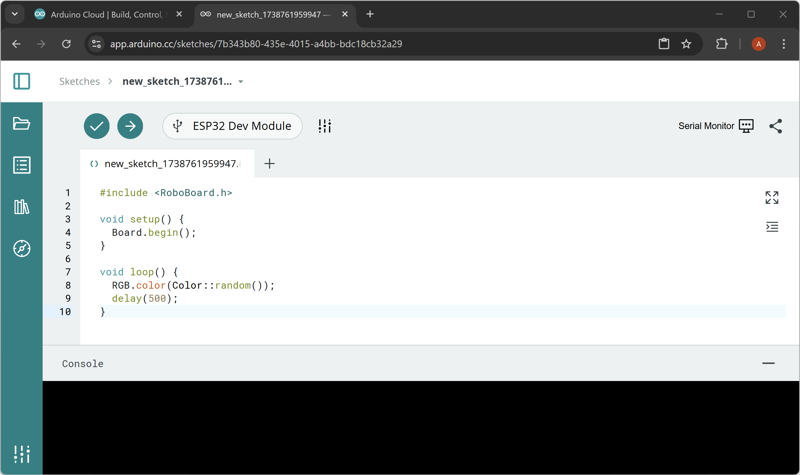
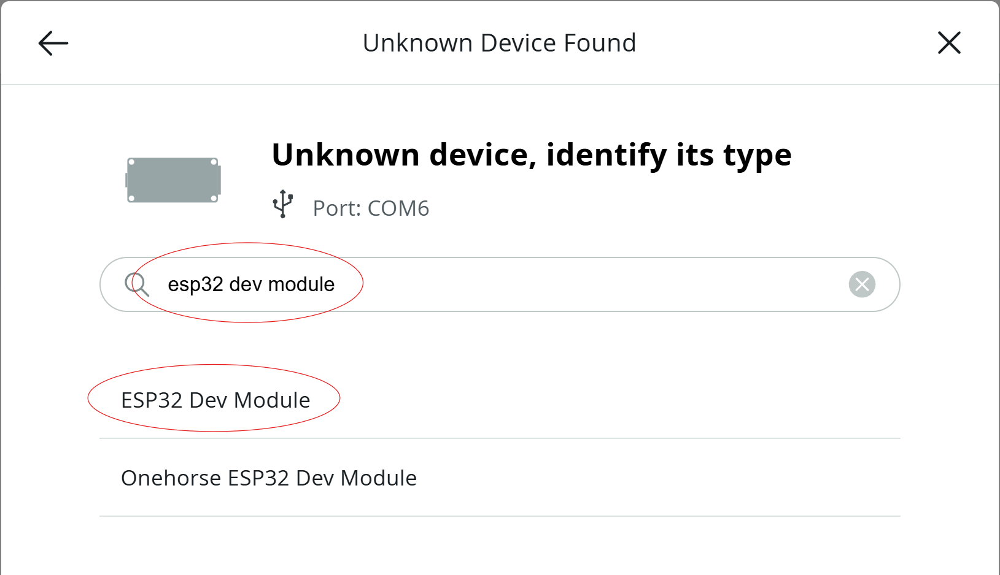
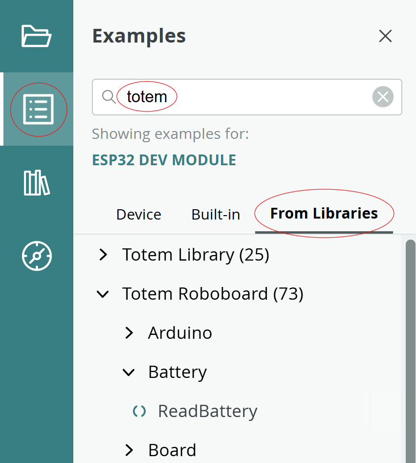

# Setup Arduino Cloud



## Step 1. Login to Arduino Cloud

[:simple-arduino: Open Arduino Cloud](https://app.arduino.cc/){ .md-button .md-button--primary target="_blank"}

_Note: install "Arduino Agent" if requested._

## Step 2. Upload code

{width=500px}

1. Connect RoboBoard to PC over USB
1. Click ++"CREATE NEW"++ -> ++"Sketch"++
1. "Unknown Device Found" window pops up. Search for `ESP32 Dev Module`.
1. Paste code inside editor and click upload button.
```arduino
#include <RoboBoard.h>

void setup() {
  Board.begin();
}

void loop() {
  RGB.color(Color::random());
  delay(500);
}
```
_Note: For MacOS change **Upload speed** to 460800 if code upload fails._  
_`RoboBoard.h` is provided by [TotemRoboboard](https://github.com/totemmaker/TotemRoboboard){target=_blank} library._

??? "Board parameters (optional)"
    Click settings icon to change parameters specific for RoboBoard.  

    - **Upload speed** - 921600 (for MacOS select 460800!)
    - **CPU Frequency** - 240MHz (WiFi/BT)
    - **Flash Frequency** - 80Mhz
    - **Flash Mode** - QIO
    - **Flash Size** - 8MB (64Mb)
    - **Partition Scheme** - 8M with spiffs (3MB APP/1.5MB SPIFFS)
    - **Core Debug Level** - None
    - **PSRAM** - Disabled
    - **Arduino Runs On** - Core 1
    - **Events Run On** - Core 1
    - **Erase All Flash Before Sketch Upload** - Disabled
    - **JTAG Adapter** - Disabled

## Step 3. Load examples

{width=300px}

1. Click examples icon. Select tab "From Libraries". Search for `totem`.
1. New window will open with example code.  
Press ++"SELECT DEVICE"++ and look for `ESP32 Dev Module` to upload the code.