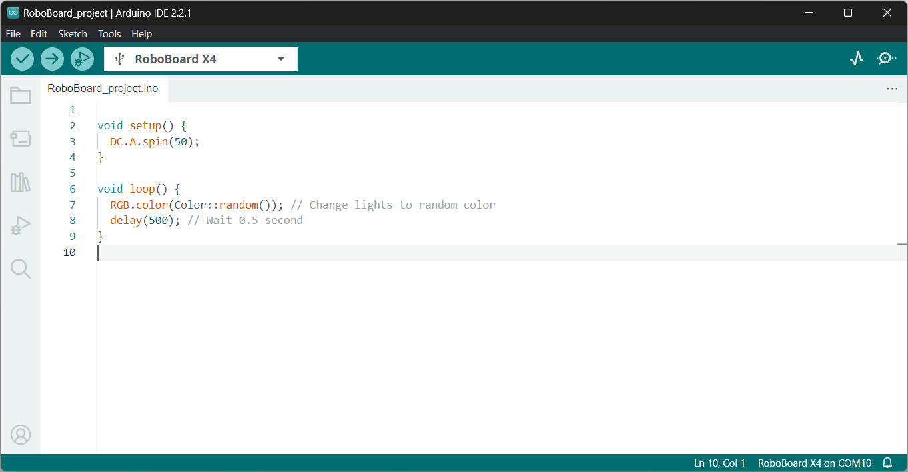
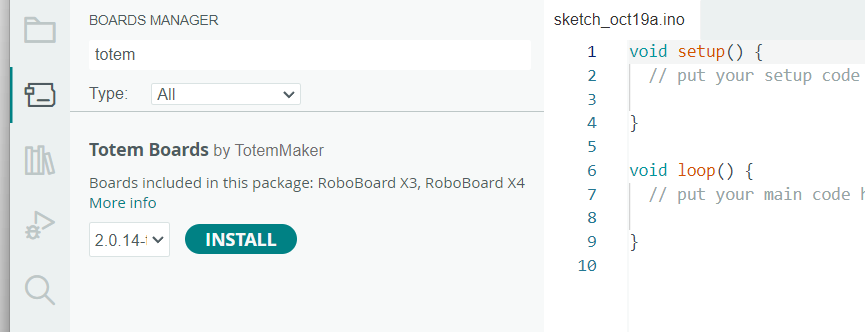
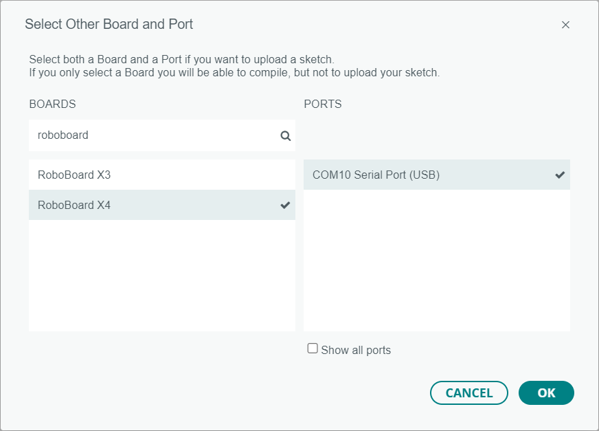
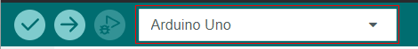
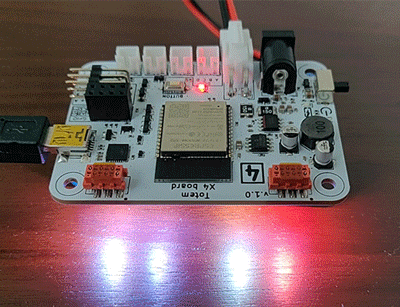
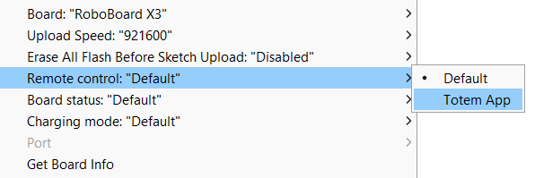

# Setup Arduino IDE 2.2


Arduino IDE stands out with its simple design, allowing to write a code, compile a project and upload it to the RoboBoard. This is one of the reasons why it's so popular among beginners. Aside from basic functionality, it has thousands of third-party libraries and code examples to create a project even faster.  


## Step 1. Download Arduino IDE

Go to Arduino website to download application for your operating system.  
_Install guide:_ [Windows / MacOS / Linux](https://docs.arduino.cc/software/ide-v2/tutorials/getting-started/ide-v2-downloading-and-installing){target="_blank"}

[:octicons-download-16: Download Arduino](https://www.arduino.cc/en/software){ .md-button .md-button--primary target="_blank"}

## Step 2. Install Totem Boards

{style="width: 80%;"}  
Install `Totem Boards` extension to add support for Totem RoboBoard.  

1. In Arduino IDE select `File` → `Preferences`.  
1. Locate `Additional Boards Manager URLs` and paste in:  
      
    ```
    https://totemmaker.github.io/TotemArduinoBoards/package_totemmaker_index.json
    ```  
    *If you have multiple URLs, click a button next to input field and add this link to the bottom.*
1. Click ++"OK"++.  
1. Open Boards Manager in side panel and type `totem` in search field.  
1. Click ++"Install"++ on `Totem Boards` and wait for it to complete. It can take a few minutes.  

_Full tutorial how to use board manager: [Using the Board Manager](https://docs.arduino.cc/software/ide-v2/tutorials/ide-v2-board-manager){target="_blank"}._

## Step 3. Compile and upload code

{style="width: 70%;"}  
Load example code and upload it to RoboBoard.  

1. Connect RoboBoard to PC over USB cable and power it on.  
1. Click on boards field and select `Select other board and port...`  
{style="width: 400px;"}  
1. Inside new dialog search for `roboboard` and select `RoboBoard X4` (or `RoboBoard X3`).  
Also select USB port board is connected to and click ++"OK"++  
1. Select `File` → `Examples` → `> RoboBoard` → `RGB` → `ColorRun`.  
1. Select `Tools` → `Port` and click on the port displayed there.  
_If `Port` is not available - check if RoboBoard is on and plugged to PC with USB cable._  
_If there are multiple ports, disconnect USB cable and check which one is gone. Reconnect and select it._  
1. Select `Sketch` → `Upload` and wait till it completes (can take a few minutes first time).  
_Note: in case upload fails - try selecting lower speed in `Tools` → `Upload speed`._  
1. RoboBoard RGB will start to blink in different colors. There is an example for each functionality, including a simple description.  



_Full tutorial how to compile and upload code: [Upload a sketch](https://docs.arduino.cc/software/ide-v2/tutorials/getting-started/ide-v2-uploading-a-sketch){target="_blank"}_.  
_In case of RoboBoard X4 - make sure the battery or DC jack is connected and power switch is turned on. It won't work from USB alone!_.  

## Step 4. Project settings



Menu option `Tools` contains Board settings that can change code build and upload parameters.

- **Board** - board type selection
- **Upload speed** - firmware upload speed. Use highest, unless upload errors occur
- **Erase All Flash Before Sketch Upload** - fully erase ESP32 flash before new firmware upload
- **Remote control** - makes RoboBoard discoverable by [Totem App](../remote-control/app/index.md) when selected
- **Board status** - enable [RoboBoard status](../roboboard/api/board.md#setStatusRGB) with RGB lights and beeping
- **Charging mode** - enable RoboBoard X3 [charging mode](../roboboard/api/board.md#setChargingMode)
- **Port** - USB port name RoboBoard is connected to (required for Serial Monitor and upload)

## Step 5. Using Arduino IDE

For more information about getting started with Arduino, read following topics:  

**User interface:**

- [Getting Started with Arduino IDE](https://docs.arduino.cc/software/ide-v2/tutorials/getting-started-ide-v2){target="_blank"} - walk around Arduino IDE UI
- [Uploading sketch with the Arduino IDE](https://docs.arduino.cc/software/ide-v2/tutorials/getting-started/ide-v2-uploading-a-sketch){target="_blank"} - upload compiled code to RoboBoard
- [Installing libraries](https://docs.arduino.cc/software/ide-v2/tutorials/ide-v2-installing-a-library){target="_blank"} - install third-party libraries
- [Autocomplete feature](https://docs.arduino.cc/software/ide-v2/tutorials/ide-v2-autocomplete-feature){target="_blank"} - displays code suggestions while typing

**Monitor:**

- [Using Serial Monitor](https://docs.arduino.cc/software/ide-v2/tutorials/ide-v2-serial-monitor){target="_blank"} - view `Serial.print()` output
- [Using Serial Plotter](https://docs.arduino.cc/software/ide-v2/tutorials/ide-v2-serial-plotter){target="_blank"} - view plotted graphs

**Code documentation:**

- [RoboBoard board settings](../roboboard/index.md#board-settings){target="_blank"} - RoboBoard settings and default firmware
- [RoboBoard API documentation](../roboboard/api/index.md){target="_blank"} - RoboBoard functions documentation
- [Arduino code reference](https://www.arduino.cc/reference/en/){target="_blank"} - Arduino functions documentation

**Code examples:**

- [Connect GPIO and Qwiic](../roboboard/api/gpio-qwiic.md){target="_blank"} - interface GPIO pins and Qwiic modules
- [Interface with Totem App](../remote-control/app/custom-function.md){target="_blank"} - read commands from Totem App
- [RoboBoard code examples](https://github.com/totemmaker/TotemArduinoBoards/tree/master/libraries/TotemRB/examples){target="_blank"} - RoboBoard specific code examples
- [ESP32 code examples](https://github.com/totemmaker/TotemArduinoBoards/tree/master/libraries){target="_blank"} - ESP32 processor specific code examples
- [Arduino examples / projects](https://docs.arduino.cc/built-in-examples/){target="_blank"} - general Arduino example projects

!!! question
    **Visit :information_source: [Support page](../support.md) to find more information or help from our community.**