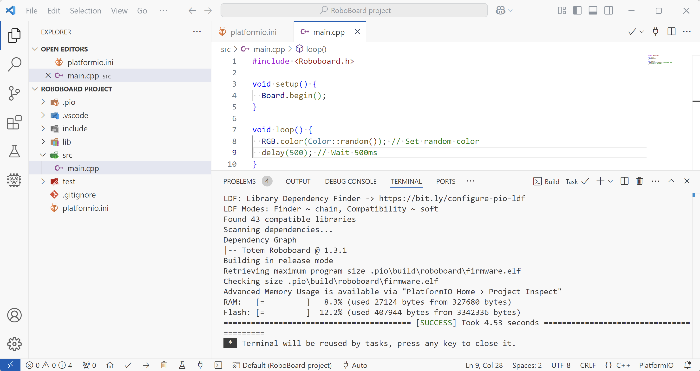
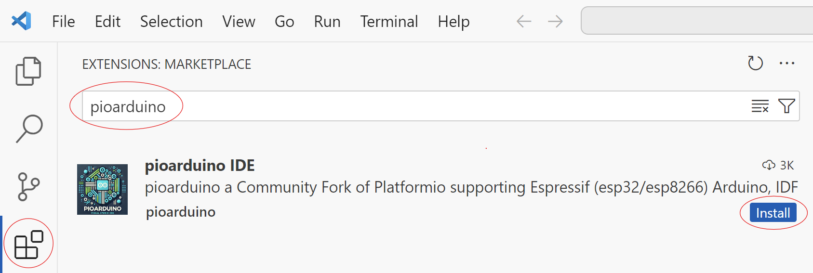
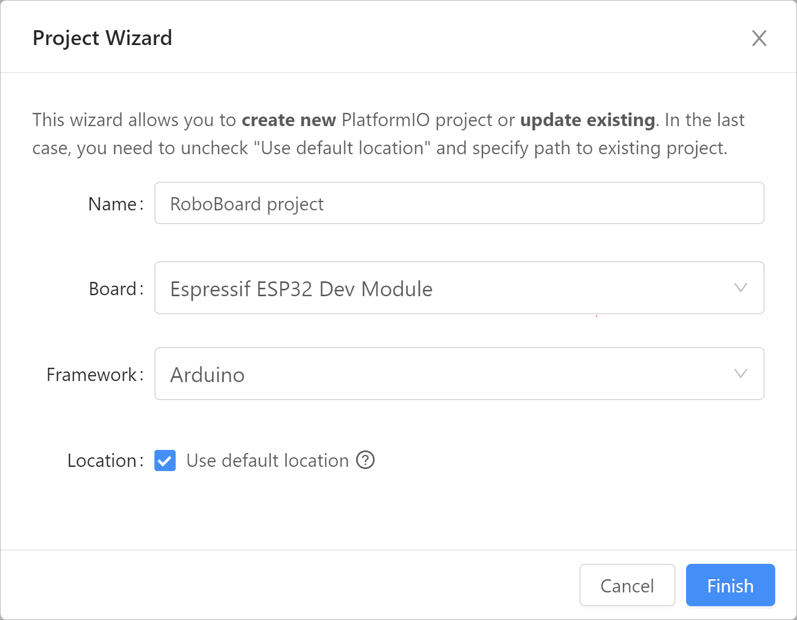

# Setup PIO Arduino


An extension for Visual Studio Code editor to enable ESP32 boards programming. Supports multiple development boards, Arduino libraries, syntax highlighting, autocomplete, indexing, extensions and many more.

## Step 1. Install PIO Arduino

[:octicons-download-16: Download Visual Studio Code](https://code.visualstudio.com/){ .md-button .md-button--primary target="_blank"}

Click Extensions icon -> search for `pioarduino` -> click ++"Install"++.



## Step 2. Create project

{style="width: 60%;"}

1. Open PIO Home by clicking :simple-pioarduino: → `PIO Home` → `Open`.
1. Click ++"\+ New Project"++ and select:  
    **Name:** _any project name_.  
    **Board:** select `Espressif ESP32 Dev Module`.  
    **Framework:** select `Arduino`.  
1. Click ++"Finish"++ and project will be created.  
    _Note: creating project first time can take a few minutes. Wait for it to finish._
1. Open `platformio.ini` file and replace its content with:
```asm title="platformio.ini"
; Project Configuration File
[env:roboboard]
platform = https://github.com/pioarduino/platform-espressif32/releases/download/stable/platform-espressif32.zip
board = esp32dev
framework = arduino

lib_deps = totemmaker/Totem Roboboard

monitor_dtr = 0
monitor_rts = 0
monitor_speed = 115200
monitor_filters = esp32_exception_decoder

upload_speed = 1000000

board_build.f_flash = 80000000L
board_build.partitions = default_8MB.csv
board_upload.flash_size = 8MB
board_upload.maximum_size = 8388608
```
Save file and wait for loading to finish.  
1. Inside `src/main.cpp` write Arduino code ant build a project.  
```arduino
#include <Roboboard.h> # Include RoboBoard control functions

void setup() {
  Board.begin(); // Initialize RoboBoard
}

void loop() {
  RGB.color(Color::random()); // Set random color
  delay(500); // Wait 500ms
}
```  
_Code and configuration is the same for RoboBoard X3 and RoboBoard X4._  
_`RoboBoard.h` is provided by [TotemRoboboard](https://github.com/totemmaker/TotemRoboboard){target=_blank} library._

## Step 3. Using PIO Arduino

Now you can build and upload the code to develop custom program for Totem RoboBoard.  
[PIO Arduino](https://github.com/pioarduino){target=_blank} is modified PlatformIO extension, enabling to use latest [ESP32 Arduino Core](https://github.com/pioarduino/platform-espressif32/releases){target=_blank}.  
For more information read following topics:  

**User interface:**

- [Home](https://docs.platformio.org/en/latest/home/index.html#demo){target="_blank"} - main page
- [Quick Start guide](https://docs.platformio.org/en/latest/integration/ide/vscode.html#quick-start){target="_blank"} - quick walk around UI
- [`platformio.ini` configuration](https://docs.platformio.org/en/latest/projectconf/index.html){target="_blank"} - project configuration file

**Code documentation:**

- [RoboBoard board settings](../roboboard/index.md#board-settings){target="_blank"} - RoboBoard settings and default firmware
- [RoboBoard API documentation](../roboboard/api/index.md){target="_blank"} - RoboBoard functions documentation
- [Arduino code reference](https://www.arduino.cc/reference/en/){target="_blank"} - Arduino functions documentation

**Code examples:**

- [Connect GPIO and Qwiic](../roboboard/api/gpio-qwiic.md){target="_blank"} - interface GPIO pins and Qwiic modules
- [Interface with Totem App](../remote-control/app/custom-function.md){target="_blank"} - read commands from Totem App
- [RoboBoard code examples](https://github.com/totemmaker/TotemArduinoBoards/tree/master/libraries/TotemRB/examples){target="_blank"} - RoboBoard specific code examples
- [ESP32 code examples](https://github.com/totemmaker/TotemArduinoBoards/tree/master/libraries){target="_blank"} - ESP32 processor specific code examples
- [Arduino examples / projects](https://docs.arduino.cc/built-in-examples/){target="_blank"} - general Arduino example projects

!!! question
    **Visit :information_source: [Support page](../support.md) to find more information or help from our community.**
