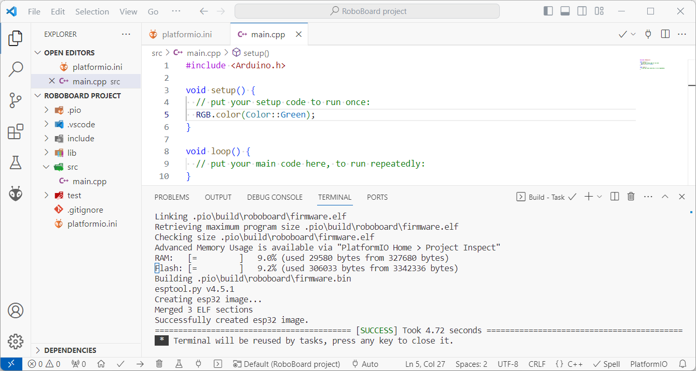
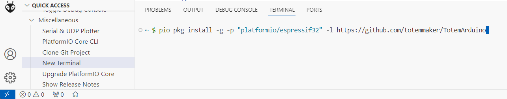
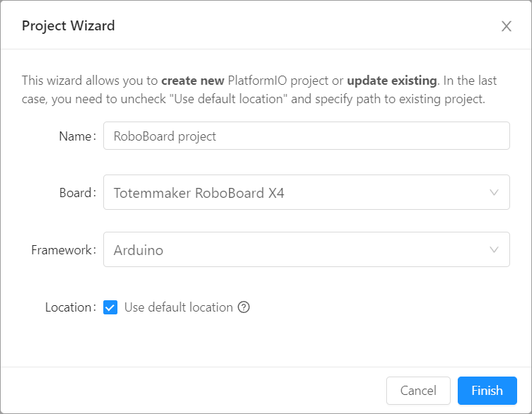

# Setup PlatformIO


PlatformIO is built on top of industry leading Visual Studio Code editor. It supports many microcontroller architectures, development boards and can utilize Arduino libraries. Furthermore, Visual Studio Code has all modern editor features like syntax highlighting, autocomplete, indexing, extensions and many more.

## Step 1. Setup PlatformIO

Go to PlatformIO website to install environment for your operating system.  
Make sure to check [Quick Start](https://docs.platformio.org/en/latest/integration/ide/vscode.html#quick-start){target="_blank"} guide.  
[:octicons-download-16: Install PlatformIO](https://platformio.org/install/ide?install=vscode){ .md-button .md-button--primary target="_blank"}

## Step 2. Install Totem Boards



1. Open PIO terminal by clicking PlatformIO icon  → `Miscellaneous` → `New Terminal`.  
1. Inside Terminal window run command and wait for it to finish:  
`pio pkg install -g -p "platformio/espressif32" -l https://github.com/totemmaker/TotemArduino`

??? "Expected terminal output (click to expand)"
    ```bash
    ~ $ pio pkg install -g -p "platformio/espressif32" -l https://github.com/totemmaker/TotemArduino
    Platform Manager: Installing platformio/espressif32
    Unpacking  [####################################]  100%
    Platform Manager: espressif32@6.4.0 has been installed!
    Tool Manager: Installing espressif/toolchain-xtensa-esp32 @ 8.4.0+2021r2-patch5
    Unpacking  [####################################]  100%
    Tool Manager: toolchain-xtensa-esp32@8.4.0+2021r2-patch5 has been installed!
    Tool Manager: Installing platformio/tool-esptoolpy @ ~1.40501.0
    Unpacking  [####################################]  100%
    Tool Manager: tool-esptoolpy@1.40501.0 has been installed!
    Library Manager: Installing git+https://github.com/totemmaker/TotemArduino
    git version 2.33.1.windows.1
    Cloning into 'C:\Users\username\.platformio\.cache\tmp\pkg-installing-_pt89bn_'...
    remote: Enumerating objects: 119, done.
    remote: Counting objects: 100% (119/119), done.
    remote: Compressing objects: 100% (72/72), done.
    Receiving objects:  94% (112/119)sed 94 (delta 12), pack-reused 0
    Receiving objects: 100% (119/119), 73.74 KiB | 2.11 MiB/s, done.
    Resolving deltas: 100% (15/15), done.
    Totem boards installed:
    C:\Users\username\.platformio\boards\roboboard_x3.json
    C:\Users\username\.platformio\boards\roboboard_x4.json
    Library Manager: Totem Library@1.1.2+sha.5cf56ce has been installed! 
    ~ $
    ```

## Step 3. Create project

{style="width: 60%;"}

1. Open PIO Home by clicking PlatformIO icon  → `PIO Home` → `Open`.  
1. Click ++"\+ New Project"++. "Project Wizard" window will open.  
1. Fill in fields:  
    **Name:** type in any project name.  
    **Board:** select `Totemmaker RoboBoard X3` (or X4).  
    **Framework:** select Arduino Framework.  
1. Click ++"Finish"++ and project will be created.  
    _Note: creating project first time can take a few minutes. Wait for it to finish._
1. Open `platformio.ini` file and replace its content with:
```asm title="platformio.ini"
; PlatformIO Project Configuration File
[env:roboboard]
; Use Arduino with Totem software
platform = espressif32
framework = arduino
platform_packages = framework-arduinoespressif32@https://github.com/totemmaker/TotemArduinoBoards
; Select roboboard_x3 or roboboard_x4
board = roboboard_x4
; Serial Monitor baud rate
monitor_speed = 115200
; Uncomment if experiencing upload issues
; upload_speed = 460800
; Decodes error message in Serial Monitor
monitor_filters = esp32_exception_decoder
; Required for Serial Monitor to work
monitor_dtr = 0
monitor_rts = 0
```
Save file and wait for loading to finish.  
1. Inside `src/main.cpp` write Arduino code ant build a project.  
```arduino
#include <Arduino.h> // Must include Arduino.h

void setup() {
  
}

void loop() {
  RGB.color(Color::random()); // Change lights to random color
  delay(500); // Wait 0.5 second
}
```  
_Note: in case upload fails - try lower `upload_speed`. Available values:_  
_Windows: `921600` `512000` `256000` `115200`_  
_MacOS/Linux: `921600` `460800` `230400` `115200`_  

## Step 4. Using PlatformIO

Now you can build and upload the code, using all Totem software features.  
Remember: PlatformIO requires to have `#!arduino #include <Arduino.h>` at the top of `main.cpp` file.

For more information about getting started with Arduino and PlatformIO, read following topics:  

**User interface:**

- [PlatformIO Quick Start guide](https://docs.platformio.org/en/latest/integration/ide/vscode.html#quick-start){target="_blank"} - quick walk around PlatformIO UI
- [PlatformIO Home](https://docs.platformio.org/en/latest/home/index.html){target="_blank"} - main PlatformIO page
- [`platformio.ini` configuration](https://docs.platformio.org/en/latest/projectconf/index.html){target="_blank"} - project configuration file

**Code documentation:**

- [RoboBoard board settings](../roboboard/index.md#board-settings){target="_blank"} - RoboBoard settings and default firmware
- [RoboBoard API documentation](../roboboard/api/index.md){target="_blank"} - RoboBoard functions documentation
- [Arduino code reference](https://www.arduino.cc/reference/en/){target="_blank"} - Arduino functions documentation

**Code examples:**

- [Connect GPIO and Qwiic](../roboboard/api/gpio-qwiic.md){target="_blank"} - interface GPIO pins and Qwiic modules
- [Interface with Totem App](../remote-control/app/custom-function.md){target="_blank"} - read commands from Totem App
- [RoboBoard code examples](https://github.com/totemmaker/TotemArduinoBoards/tree/master/libraries/TotemRB/examples){target="_blank"} - RoboBoard specific code examples
- [ESP32 code examples](https://github.com/totemmaker/TotemArduinoBoards/tree/master/libraries){target="_blank"} - ESP32 processor specific code examples
- [Arduino examples / projects](https://docs.arduino.cc/built-in-examples/){target="_blank"} - general Arduino example projects

!!! question
    **Visit :information_source: [Support page](../support.md) to find more information or help from our community.**
