# I/O panel #1

<blockquote style="text-align:right;margin-top:-20px;margin-right:14px;border-left:0;line-height:0;font-size:9pt;">Click image to jump to specific module</blockquote>

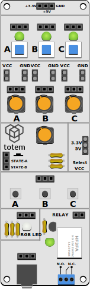{ align=right style="height:750px" usemap="#panel_modules" }

<map name="panel_modules">
  <area shape="rect" coords="0,0,250,40" alt="Power" href="#power">
  <area shape="rect" coords="0,40,250,158" alt="Switches" href="#switches">
  <area shape="rect" coords="0,158,250,317" alt="Potentiometers" href="#potentiometers">
  <area shape="rect" coords="0,317,177,445" alt="Rotary encoder" href="#rotary-encoder">
  <area shape="rect" coords="177,317,250,445" alt="VCC Select" href="#power">
  <area shape="rect" coords="0,445,250,540" alt="Buttons" href="#buttons">
  <area shape="rect" coords="0,540,104,623" alt="RGB LED" href="#rgb-led">
  <area shape="rect" coords="104,540,250,750" alt="Relay" href="#relay">
  <area shape="rect" coords="0,623,104,750" alt="3.5mm adapter" href="#35mm-adapter">
</map>

**Contains:**  

* [3 push-push switches with LED indicators](#switches)
* [3 Potentiometers](#potentiometers)
* [1 Rotary encoder switch](#rotary-encoder)
* [3 push button switches](#buttons)
* [1 RGB-LED (can show virtually any color)](#rgb-led)
* [1 Relay with LED indicator](#relay)
* [1 3.5mm jack connector](#35mm-adapter)

**Arduino examples:** [:simple-github: Github](https://github.com/totemmaker/arduino-examples/tree/master/mini-lab/sidepanel1_demos){target=_blank} | [:material-cart: _TE-SP01-B_](https://totemmaker.net/product/input-output-side-panel-soldered-totem-mini-lab/){target=_blank}  

This side panel is oriented to user input components. Various switches and buttons provides regulated control of connected circuits. This is useful to start some action (connect circuit), set specific configuration, regulate resistance or voltage. RGB LED can be conveniently used to display circuit state or to play around learning electronics.

## Power

On the top of the board there is (POWER IN) pin header to supply power to side panel components. Some of them requires certain voltage to operate, but otherwise they’re fully isolated from one another, and can be used independently.

**Power up side panel:**  
Side panel requires power (3.3V, 5V) for certain modules to work. It does not have its own voltage regulator so typically, regulated voltage has to be sourced from TotemDuino or LabBoard. Recommended to plug in all 3 wires as some modules use different voltages.  
[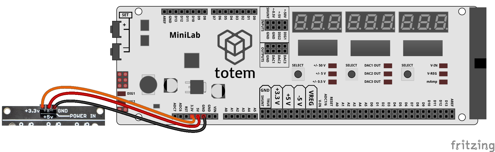](../assets/images/mini-lab/io-panel-power_bb.png)

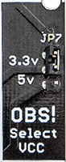{ align=right }

**Select logic voltage level:**  
Side panel contains logic level voltage (VCC) select for digital signals to work either at 3.3 or 5 Volt. Marked OBS! (Observe!).  
By moving **JP7** jumper up or down - you can select between 3.3V and 5V. This is useful if you have some components that are 3.3 Volt only (could be damaged if used with 5V). In that case place jumper on 3.3V position and use side panel pins safely. It’s important to have the same logic level as the controller board (e.g., TotemDuino), for best results. 

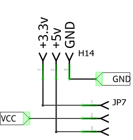{ align=right width=170 }

Places where selected voltage (VCC) is used:  

- VCC for potentiometers
- pull-up resistors (R4, R5, R6) for encoder
- power for RGB-LED

Switch and relay modules are always using **+5v** to power indication LED and relay itself.

## Switches

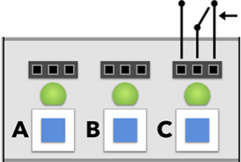{align=right}

Latched switches with LED indication - can be wired to use normally-on or normally-off position.

**Pin header:**  

- **pin 1** - switch pressed in (LED on)
- **pin 2** - common pin (connects to **pin 1** or **pin 3**)
- **pin 3** - switch pressed out (LED off)

**Info:**

- Green LED indicates switch state.  
- All 3 (A, B, C) switches are separate and can be used individually.  
- Image on silkscreen displays pin contact when switch is pressed out (LED off).  

**Power:**

- Uses **+5v** POWER IN to light up indication LEDs. This circuit is isolated and does not connect to switch pin headers.

| Schematic | Experiment |
| --- | --- |
| [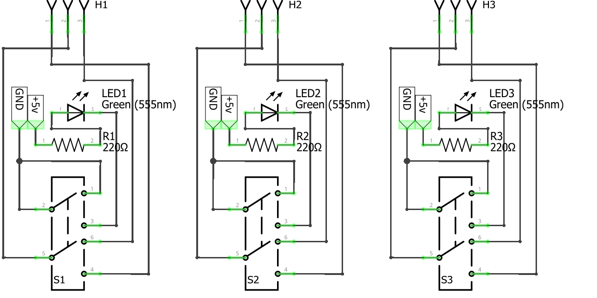{width=280}](../assets/images/mini-lab/io-panel-switch_sh.png) | [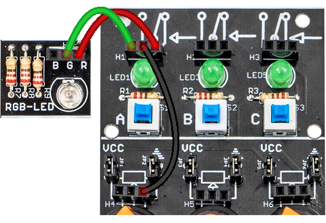{width=300}](../assets/images/mini-lab/io-panel-switch_bb.png)   _Toggle switch A to see RGB color change._ |

## Potentiometers

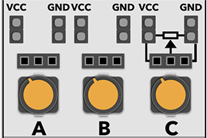{align=right}

Group of potentiometers to adjust amount of resistance or use as voltage divider.

**Pin header:**  

- **pin 1** - potentiometer VCC 
- **pin 2** - potentiometer Output
- **pin 3** - potentiometer GND
- **JP1** - jumper to connect **pin 1** to **VCC**
- **JP2** - jumper to connect **pin 3** to **GND**

**Info:**

- Turning counterclockwise (left) - increases resistance **pin 2** - **pin 1** (VCC).  
  _In case voltage divider - decreases voltage on Output._
- Turning clockwise (right) - increases resistance **pin 2** - **pin 3** (GND ⏚).  
  _In case voltage divider - increases voltage on Output._
- When jumpers **JP1** and **JP2** are in place - potentiometer works as [voltage divider](https://en.wikipedia.org/wiki/Voltage_divider){target=_blank}.  
  Removing them leaves **pin 1** and **pin 3** unconnected to VCC and GND.
- All 3 (A, B, C) potentiometers are separate and can be used individually.  
- Potentiometer are rated for **~100kΩ** resistance.  
- Connect potentiometer output to TotemDuino pin **A0** and use function `#!arduino analogRead(A0)` to get its position (value between 0-1023).  

**Power:**

- Uses **VCC**. 3.3V or 5V, depending on **JP7** position.

| Schematic | Experiment |
| --- | --- |
| [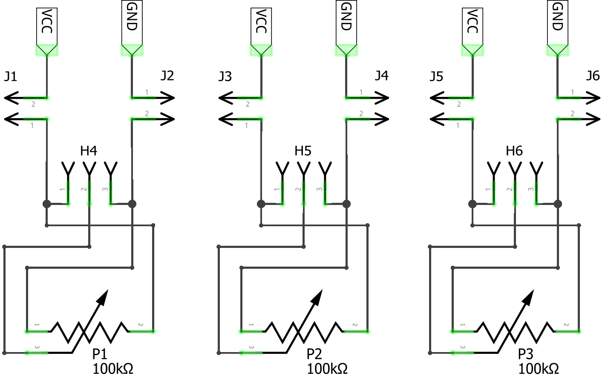{width=250}](../assets/images/mini-lab/io-panel-potentiometer_sh.png) | [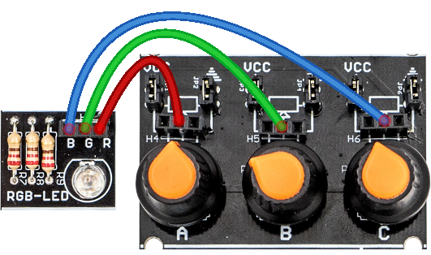{width=310}](../assets/images/mini-lab/io-panel-potentiometer_bb.png)   _Mix color by turning potentiometers._ |

## Rotary encoder

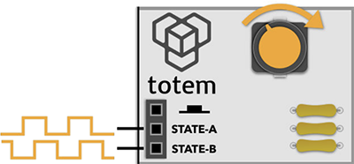{align=right}

Rotary knob that gives out pulses when rotated. Also includes a pushable button.

**Pin header:**  

- **pin 1** - knob press
- **pin 2** - rotate signal A
- **pin 3** - rotate signal B

**Info:**

- Arduino example: [Tracking encoder position](https://github.com/totemmaker/arduino-examples/tree/master/mini-lab/sidepanel1_demos/encoder_simple){target=_blank}.
- Captures control knob rotation and outputs two phase-locked signals on it’s output at header H7, **pin 2** and **pin 3**. As these signals are always delayed by 90 degrees from each other, its possible to extract direction information, together with rotation speed from the frequency of it.  
- Pressing knob connects **pin 1** to GND (⏚). Otherwise it's pulled high to VCC (using R4 resistor).  
- Signals A, B connects to GND (⏚) when turning knob. Otherwise they are pulled high to VCC (using R5, R6 resistors). Also using C1 and C2 capacitors to prevent [debouncing](https://en.wikipedia.org/wiki/Switch#Contact_bounce){target=_blank}.  

**Power:**

- Uses **VCC** for pull-up resistors (R4, R5, R6).

| Schematic | Experiment |
| --- | --- |
| [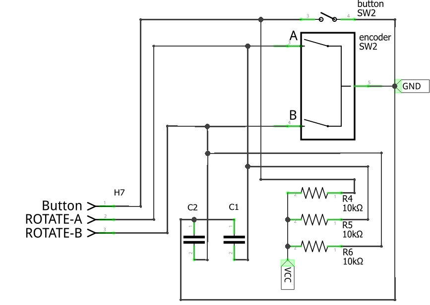{width=250}](../assets/images/mini-lab/io-panel-encoder_sh.png) | [{width=340}](../assets/images/mini-lab/io-panel-encoder_bb.png)   _Turn knob to view encoder signal output._ |

## Buttons

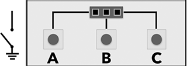{align=right}

Group of simple tactile push buttons.

**Pin header:**  

- **pin 1** - button A
- **pin 2** - button B
- **pin 3** - button C

**Info:**  

- Arduino example: [Detecting button click](https://github.com/totemmaker/arduino-examples/tree/master/mini-lab/sidepanel1_demos/button){target=_blank}.
- Simple non-locked buttons that connect the signals from header H8 to GND (⏚).  
- Does not have pull-up resistor or [debouncing](https://en.wikipedia.org/wiki/Switch#Contact_bounce){target=_blank} circuit.  

| Schematic | Experiment |
| --- | --- |
| [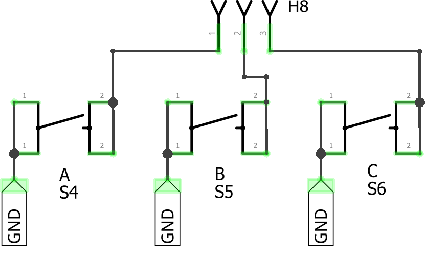{width=250}](../assets/images/mini-lab/io-panel-button_sh.png) | [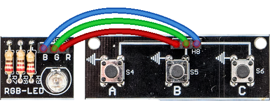{width=300}](../assets/images/mini-lab/io-panel-button_bb.png)   _Light up RGB color when button is pressed._ |

## RGB LED

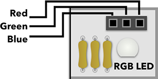{align=right}

Three color RGB LED. Can be used to mix specific color.

**Pin header:**  

- **pin 1** - blue color
- **pin 2** - green color
- **pin 3** - red color

**Info:**  

- Arduino example: [Mixing colors](https://github.com/totemmaker/arduino-examples/tree/master/mini-lab/sidepanel1_demos/colourmixing){target=_blank}.
- Three color LED in one package. Each LED can be controlled independently from header H9.  
- Lights up when pin is connected to GND (⏚).  

**Power:**  

- Uses **VCC** to power LED over R7, R8, R9 resistors.  

| Schematic | Experiment |
| --- | --- |
| [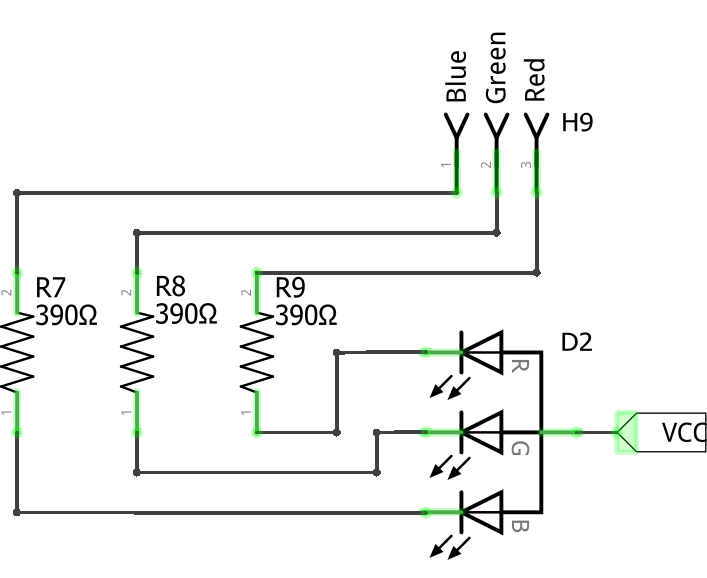{width=250}](../assets/images/mini-lab/io-panel-rgb_sh.png) | [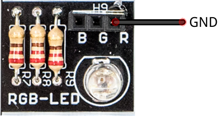{width=300}](../assets/images/mini-lab/io-panel-rgb_bb.png)   _Light up red color by wiring R to GND (⏚)._ |

## Relay

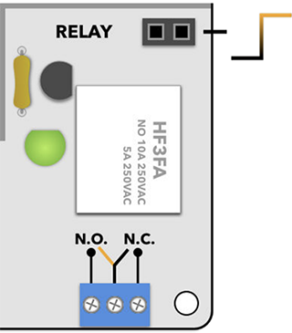{align=right width=250}

Mechanical high power switch. Can be used to control high current and voltage loads.

**Pin header:**  

- **pin 1, 2** - relay contactor signal

**Info:**  

- Arduino example: [Schmitt trigger](https://github.com/totemmaker/arduino-examples/tree/master/mini-lab/sidepanel1_demos/schmittcontrol){target=_blank}.
- Works same as Switch, but withstands high voltage and loads up to 10A.  
- Single relay, driven by a transistor. Relay latches when HIGH signal is provided to H11 header. Activation state is shown with LED4. Output changes on B1 terminals.  
- N.O. - Normally Open (relay is latched, LED on).  
- N.C. - Normally Closed (relay is not latched, LED off).  
- **It is not recommended to connect loads from power outlet, as these high voltages are dangerous.**

**Power:**

- Uses **+5v** POWER IN to supply power for relay and indication LED. 

| Schematic | Experiment |
| --- | --- |
| [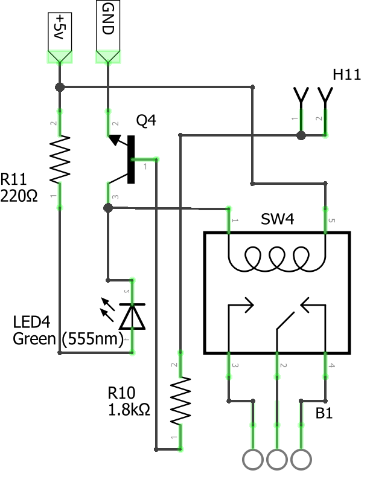{width=250}](../assets/images/mini-lab/io-panel-relay_sh.png) | [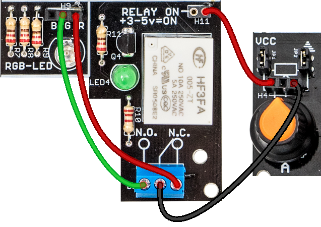{width=350}](../assets/images/mini-lab/io-panel-relay_bb.png)   _Connect red wire to H11 to toggle relay. RGB color changes between red and green._ |

## 3.5mm adapter

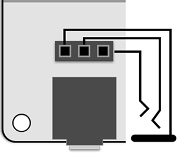{align=right width=280}

Easy access to 3.5mm audio jack connector.

**Pin header:**  

- **pin 1** - ground
- **pin 2** - right audio channel
- **pin 3** - left audio channel

**Info:**

- Easy access to a difficult to mount on a breadboard part. All signals from the jack are connected to H10 header.  
- **Pinout depends on connected device.**  
Ground, Right, Left is just most common for headphones.

| Schematic | Visual |
| --- | --- |
| [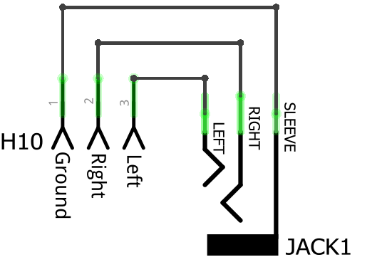{width=250}](../assets/images/mini-lab/io-panel-audio_sh.png) | [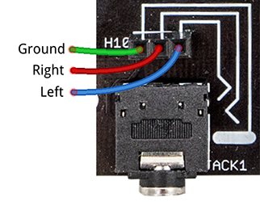{width=250}](../assets/images/mini-lab/io-panel-audio_bb.png) |

**Legacy documentation of #1 I/O side panel:**

This page contains latest documentation of audio side panel. Link below is outdated and only specified for reference.

[Version 1.1 datasheet](https://totemmaker.net/wp-content/uploads/2018/04/io-side-panel-1.1.pdf) (legacy)  
